# 宝宝成长记录 App 项目设计文档（V1.0）

---

## 1. 项目背景与目标

### 1.1 项目背景

新手父母需要频繁记录宝宝的喂养、排泄、睡眠、成长、医疗等信息，传统的纸笔或零散的电子记录方式存在诸多不便：
- 数据易丢失、难以查询
- 无法进行数据统计和趋势分析
- 多人协作记录困难
- 缺乏长期数据积累和可视化

### 1.2 项目目标

基于 **Expo + React Native** 开发一款跨平台（iOS/Android）的宝宝成长记录应用，实现：

1. **便捷记录**：高频操作（喝奶、换尿布、睡眠）一键记录
2. **数据可视化**：自动生成图表和趋势曲线
3. **多宝宝管理**：支持多个宝宝档案独立管理
4. **多设备同步**：云端数据同步，多设备协同
5. **适老化设计**：大字体、高对比度、简单操作
6. **数据安全**：iCloud 备份、数据导出导入

### 1.3 核心价值

- **时间效率**：半夜喂奶单手快速记录
- **健康洞察**：通过数据发现宝宝作息和健康规律
- **家庭协作**：多人共同记录，信息同步
- **长期价值**：完整记录宝宝成长轨迹

---

## 2. 整体架构设计

### 2.1 技术栈选型

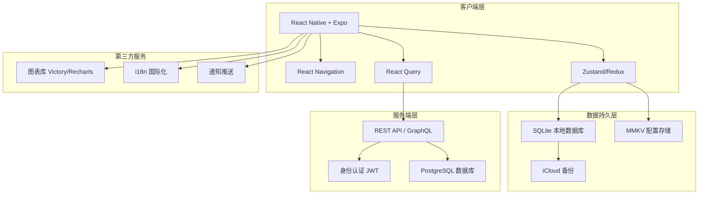

### 2.2 系统架构

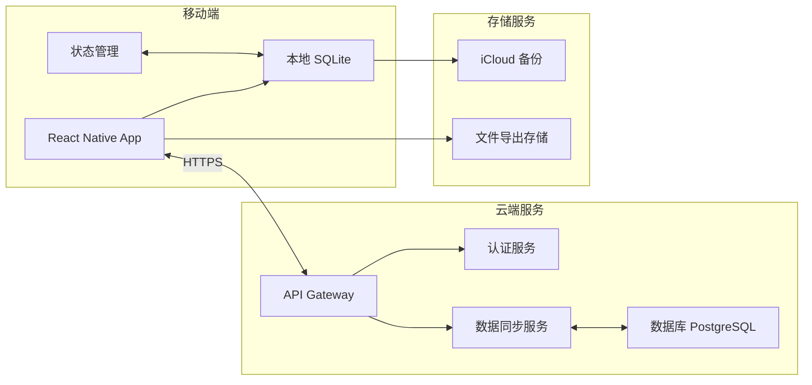

### 2.3 分层架构

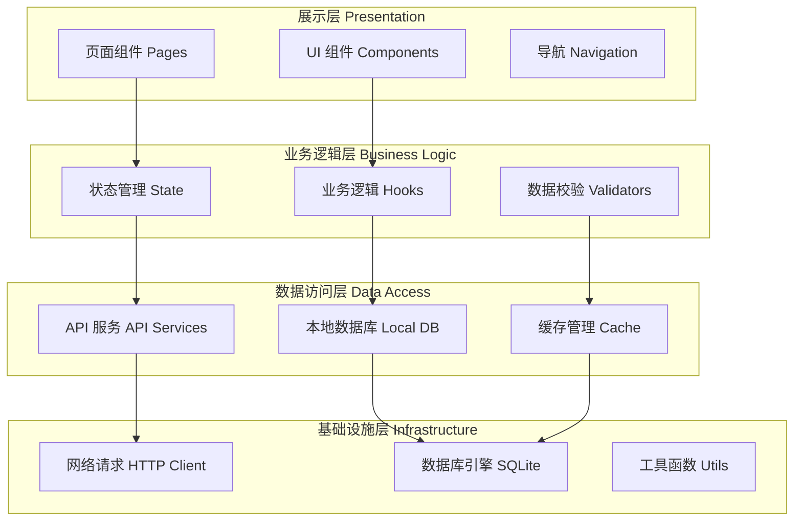

---

## 3. 关键模块设计

### 3.1 用户认证与同步模块

#### 3.1.1 认证流程

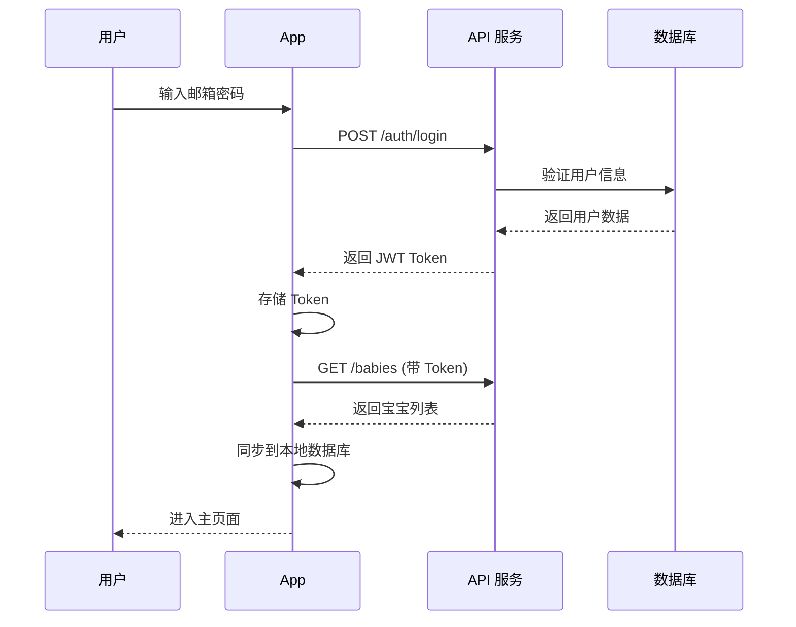

#### 3.1.2 数据同步策略

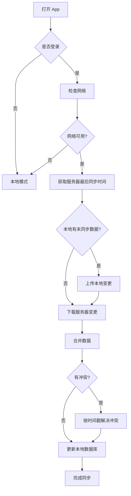

#### 3.1.3 核心接口

**认证相关 API**
```typescript
// 注册
POST /api/v1/auth/register
Body: { email, password, confirmPassword }
Response: { userId, token, refreshToken }

// 登录
POST /api/v1/auth/login
Body: { email, password }
Response: { userId, token, refreshToken, user }

// 刷新 Token
POST /api/v1/auth/refresh
Body: { refreshToken }
Response: { token, refreshToken }

// 忘记密码
POST /api/v1/auth/forgot-password
Body: { email }
Response: { message }
```

**同步相关 API**
```typescript
// 获取增量更新
GET /api/v1/sync/changes?since={timestamp}&babyId={babyId}
Response: { 
  babies: [...],
  feedings: [...],
  diapers: [...],
  sleeps: [...],
  lastSyncTime: timestamp
}

// 上传本地变更
POST /api/v1/sync/upload
Body: {
  changes: {
    created: [...],
    updated: [...],
    deleted: [...]
  }
}
Response: { success, conflicts: [...] }
```

---

### 3.2 多宝宝管理模块

#### 3.2.1 宝宝切换流程

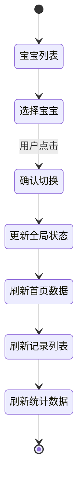

#### 3.2.2 宝宝管理操作流程

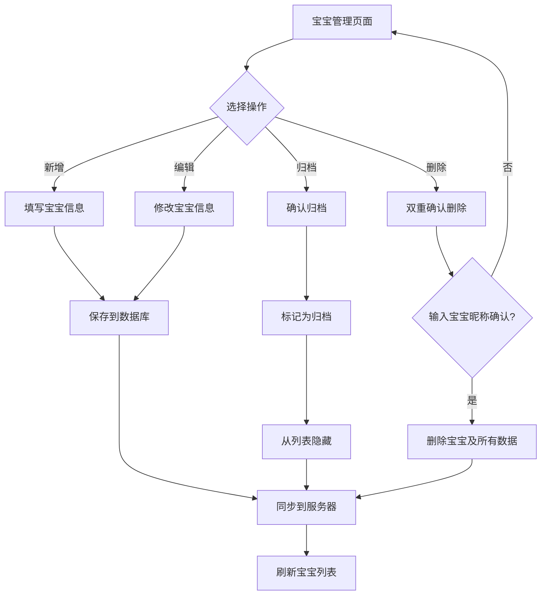

#### 3.2.3 状态管理设计

```typescript
// Zustand Store 示例
interface BabyStore {
  // 状态
  babies: Baby[];
  currentBabyId: string | null;
  
  // 计算属性
  currentBaby: Baby | null;
  activeBabies: Baby[];
  archivedBabies: Baby[];
  
  // 操作
  setBabies: (babies: Baby[]) => void;
  setCurrentBaby: (babyId: string) => void;
  addBaby: (baby: Baby) => Promise<void>;
  updateBaby: (babyId: string, data: Partial<Baby>) => Promise<void>;
  archiveBaby: (babyId: string) => Promise<void>;
  deleteBaby: (babyId: string) => Promise<void>;
}
```

---

### 3.3 日常记录模块

#### 3.3.1 快速记录流程

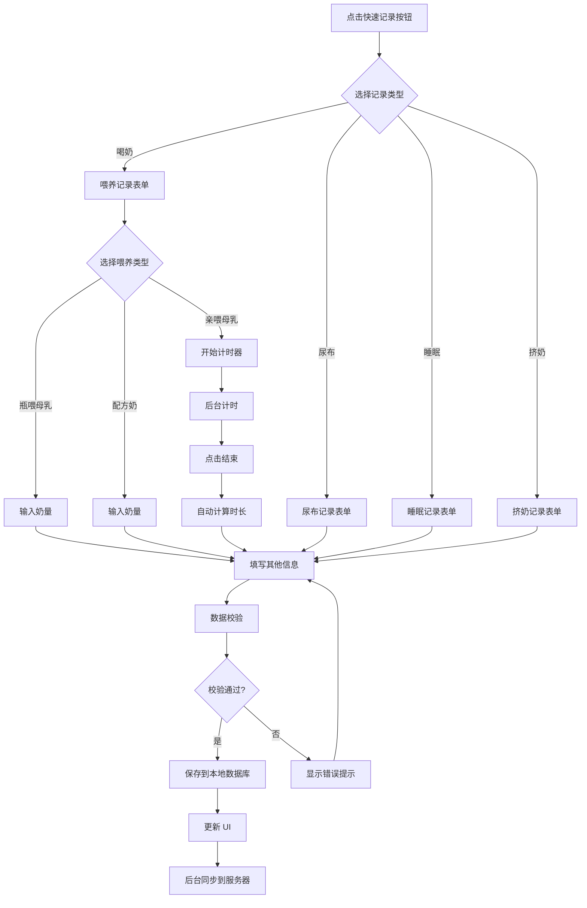

#### 3.3.2 喂养记录详细流程

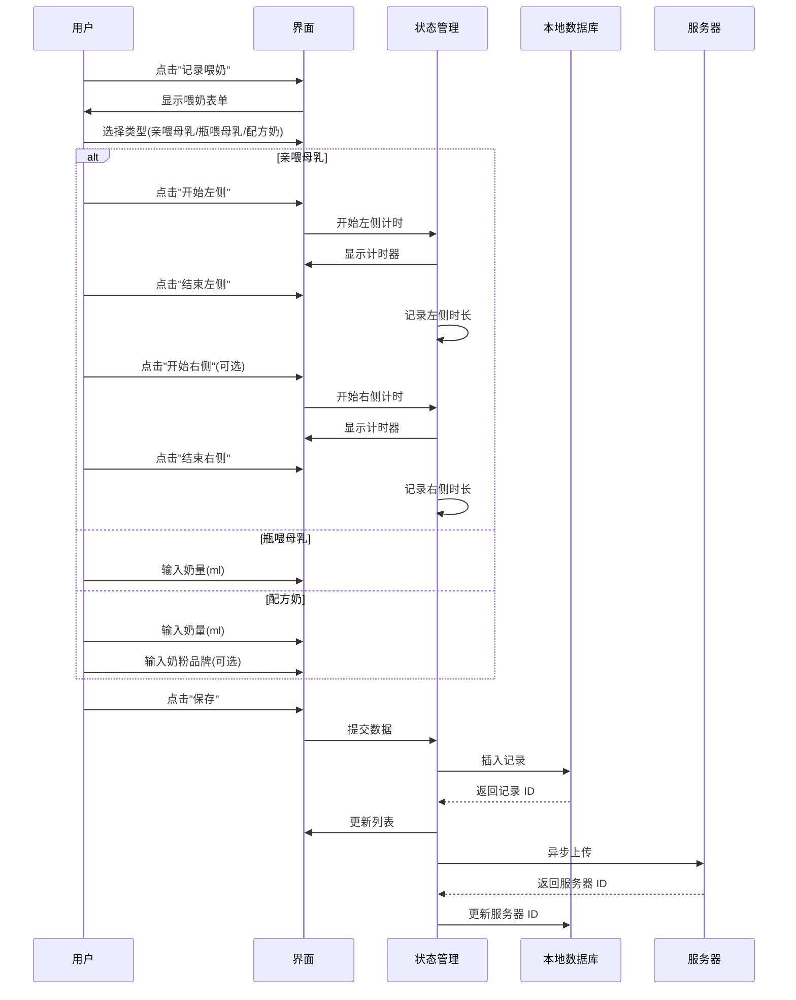

**喂养类型说明：**

1. **亲喂母乳 (breast)**
   - 场景：妈妈直接哺乳
   - 记录方式：实时计时器
   - 数据字段：`leftDuration`（左侧时长）、`rightDuration`（右侧时长）
   - 操作流程：
     - 点击"开始左侧" → 计时器开始 → 点击"结束左侧" → 记录时长
     - 可选继续点击"开始右侧" → 计时器开始 → 点击"结束右侧" → 记录时长
   - 统计分析：按时长统计，可显示每天哺乳总时长、平均单次时长

2. **瓶喂母乳 (bottled_breast_milk)**
   - 场景：用奶瓶喂挤出的母乳
   - 记录方式：输入奶量
   - 数据字段：`milkAmount`（奶量 ml）
   - 操作流程：选择"瓶喂母乳" → 输入奶量 → 保存
   - 统计分析：按奶量统计，可与挤奶记录关联分析

3. **配方奶 (formula)**
   - 场景：奶粉冲泡喂养
   - 记录方式：输入奶量和品牌
   - 数据字段：`milkAmount`（奶量 ml）、`milkBrand`（品牌）
   - 操作流程：选择"配方奶" → 输入奶量 → 输入品牌（可选）→ 保存
   - 统计分析：按奶量统计，可按品牌分类统计

**亲喂母乳计时器技术实现：**

```typescript
// 计时器状态管理
interface TimerState {
  isRunning: boolean;
  side: 'left' | 'right' | null;
  startTime: number | null;
  leftDuration: number; // 秒
  rightDuration: number; // 秒
}

// 计时器操作
const startTimer = (side: 'left' | 'right') => {
  setState({
    isRunning: true,
    side: side,
    startTime: Date.now()
  });
  // 启动计时器，每秒更新一次显示
};

const stopTimer = () => {
  const elapsed = Math.floor((Date.now() - state.startTime) / 1000);
  if (state.side === 'left') {
    setState({ leftDuration: elapsed });
  } else {
    setState({ rightDuration: elapsed });
  }
  setState({ isRunning: false, side: null });
};

// 后台计时支持
// 使用 React Native 的 AppState 监听应用进入后台/前台
// 在后台时继续计时，前台时更新显示
```

#### 3.3.3 睡眠记录流程

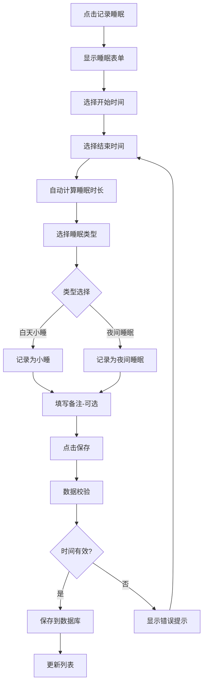

**睡眠记录说明：**

睡眠记录采用**事后填写**的方式，不使用实时计时器。这样设计的原因：

1. **实际场景考虑**：
   - 宝宝睡觉时，父母通常不会一直盯着手机
   - 宝宝醒来后，父母可以回忆并填写睡眠时间
   - 避免忘记结束计时导致数据异常

2. **用户体验优化**：
   - 提供快速时间选择（如"30分钟前"、"1小时前"、"2小时前"）
   - 支持手动精确选择时间
   - 自动根据时间段建议睡眠类型（白天/夜间）

3. **数据校验**：
   - 结束时间必须晚于开始时间
   - 睡眠时长合理性检查（如超过12小时给予提示）
   - 避免时间重叠

```typescript
// 睡眠记录表单示例
interface SleepFormData {
  startTime: Date;     // 必填
  endTime: Date;       // 必填
  sleepType: 'nap' | 'night';
  fallAsleepMethod?: string;
  notes?: string;
}

// 自动计算时长
const calculateDuration = (start: Date, end: Date): number => {
  return Math.floor((end.getTime() - start.getTime()) / 60000); // 返回分钟数
};

// 智能建议睡眠类型
const suggestSleepType = (startTime: Date): 'nap' | 'night' => {
  const hour = startTime.getHours();
  // 晚上7点到早上7点为夜间睡眠
  return (hour >= 19 || hour < 7) ? 'night' : 'nap';
};
```

---

### 3.4 数据统计与可视化模块

#### 3.4.1 数据聚合流程

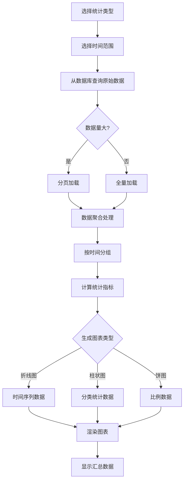

#### 3.4.2 图表渲染架构

```typescript
interface ChartConfig {
  type: 'line' | 'bar' | 'pie';
  dataKey: string;
  timeRange: TimeRange;
  aggregation: 'sum' | 'avg' | 'count' | 'max' | 'min';
}

interface ChartData {
  labels: string[];
  datasets: {
    label: string;
    data: number[];
    color: string;
  }[];
}

// 数据处理管道
const processChartData = (
  rawData: Record[],
  config: ChartConfig
): ChartData => {
  return pipe(
    filterByTimeRange(config.timeRange),
    groupByDate,
    aggregateData(config.aggregation),
    formatForChart(config.type)
  )(rawData);
};
```

---

### 3.5 数据导入导出模块

#### 3.5.1 导出流程

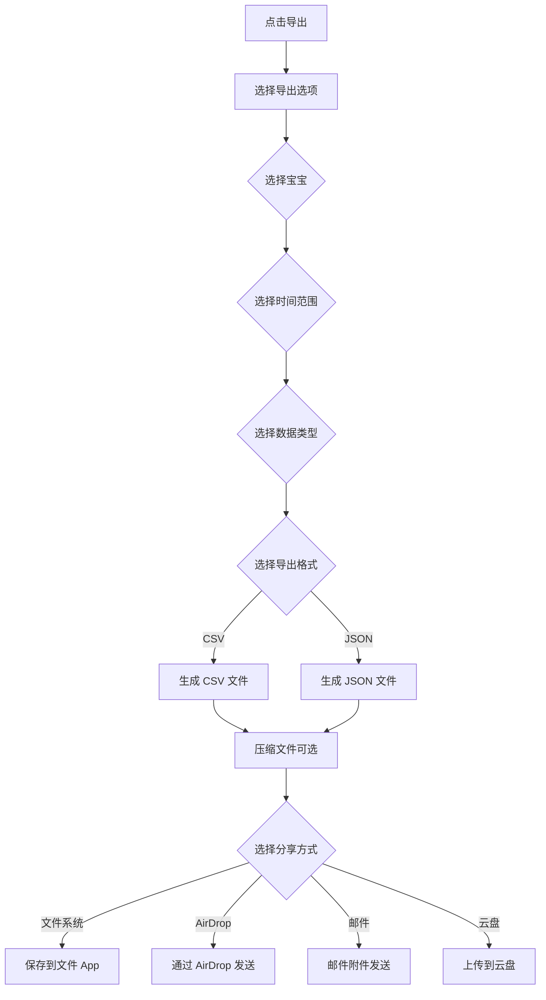

#### 3.5.2 导入流程

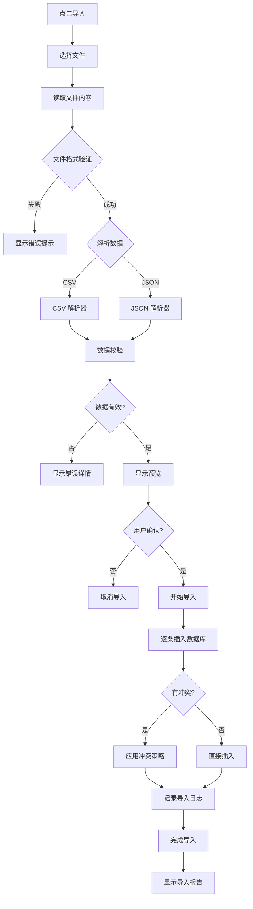

---

## 4. 数据结构设计

### 4.1 数据库 ER 图

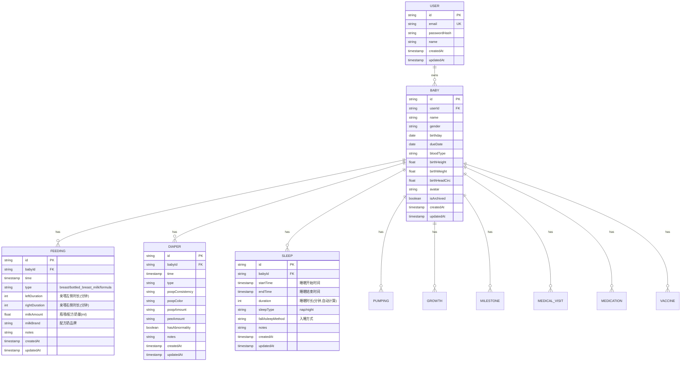

### 4.2 本地数据库表结构（SQLite）

#### 4.2.1 用户表 (users)

```sql
CREATE TABLE users (
    id TEXT PRIMARY KEY,
    email TEXT UNIQUE NOT NULL,
    password_hash TEXT NOT NULL,
    name TEXT,
    created_at INTEGER NOT NULL,
    updated_at INTEGER NOT NULL,
    synced_at INTEGER
);

CREATE INDEX idx_users_email ON users(email);
```

#### 4.2.2 宝宝表 (babies)

```sql
CREATE TABLE babies (
    id TEXT PRIMARY KEY,
    user_id TEXT NOT NULL,
    name TEXT NOT NULL,
    gender TEXT CHECK(gender IN ('male', 'female', 'unknown')),
    birthday INTEGER NOT NULL,
    due_date INTEGER,
    blood_type TEXT,
    birth_height REAL,
    birth_weight REAL,
    birth_head_circ REAL,
    avatar TEXT,
    is_archived INTEGER DEFAULT 0,
    created_at INTEGER NOT NULL,
    updated_at INTEGER NOT NULL,
    synced_at INTEGER,
    FOREIGN KEY (user_id) REFERENCES users(id) ON DELETE CASCADE
);

CREATE INDEX idx_babies_user_id ON babies(user_id);
CREATE INDEX idx_babies_is_archived ON babies(is_archived);
```

#### 4.2.3 喂养记录表 (feedings)

```sql
CREATE TABLE feedings (
    id TEXT PRIMARY KEY,
    baby_id TEXT NOT NULL,
    time INTEGER NOT NULL,
    type TEXT NOT NULL CHECK(type IN ('breast', 'bottled_breast_milk', 'formula')),
    -- breast: 亲喂母乳，记录时长
    left_duration INTEGER DEFAULT 0,  -- 左侧哺乳时长（分钟）
    right_duration INTEGER DEFAULT 0, -- 右侧哺乳时长（分钟）
    -- bottled_breast_milk/formula: 瓶喂母乳或配方奶，记录奶量
    milk_amount REAL DEFAULT 0,       -- 奶量（ml）
    milk_brand TEXT,                  -- 奶粉品牌（仅配方奶）
    notes TEXT,
    created_at INTEGER NOT NULL,
    updated_at INTEGER NOT NULL,
    synced_at INTEGER,
    FOREIGN KEY (baby_id) REFERENCES babies(id) ON DELETE CASCADE
);

CREATE INDEX idx_feedings_baby_id ON feedings(baby_id);
CREATE INDEX idx_feedings_time ON feedings(time);
CREATE INDEX idx_feedings_baby_time ON feedings(baby_id, time);
```

#### 4.2.4 尿布记录表 (diapers)

```sql
CREATE TABLE diapers (
    id TEXT PRIMARY KEY,
    baby_id TEXT NOT NULL,
    time INTEGER NOT NULL,
    type TEXT NOT NULL CHECK(type IN ('poop', 'pee', 'both')),
    poop_consistency TEXT CHECK(poop_consistency IN ('loose', 'normal', 'hard', 'other')),
    poop_color TEXT CHECK(poop_color IN ('yellow', 'green', 'dark', 'other')),
    poop_amount TEXT CHECK(poop_amount IN ('small', 'medium', 'large')),
    pee_amount TEXT CHECK(pee_amount IN ('small', 'medium', 'large')),
    has_abnormality INTEGER DEFAULT 0,
    notes TEXT,
    created_at INTEGER NOT NULL,
    updated_at INTEGER NOT NULL,
    synced_at INTEGER,
    FOREIGN KEY (baby_id) REFERENCES babies(id) ON DELETE CASCADE
);

CREATE INDEX idx_diapers_baby_id ON diapers(baby_id);
CREATE INDEX idx_diapers_time ON diapers(time);
CREATE INDEX idx_diapers_baby_time ON diapers(baby_id, time);
```

#### 4.2.5 睡眠记录表 (sleeps)

```sql
CREATE TABLE sleeps (
    id TEXT PRIMARY KEY,
    baby_id TEXT NOT NULL,
    start_time INTEGER NOT NULL,      -- 睡眠开始时间
    end_time INTEGER NOT NULL,        -- 睡眠结束时间（必填）
    duration INTEGER NOT NULL,        -- 睡眠时长（分钟），自动计算
    sleep_type TEXT NOT NULL CHECK(sleep_type IN ('nap', 'night')), -- nap: 白天小睡, night: 夜间睡眠
    fall_asleep_method TEXT,          -- 入睡方式（可选）
    notes TEXT,
    created_at INTEGER NOT NULL,
    updated_at INTEGER NOT NULL,
    synced_at INTEGER,
    FOREIGN KEY (baby_id) REFERENCES babies(id) ON DELETE CASCADE
);

CREATE INDEX idx_sleeps_baby_id ON sleeps(baby_id);
CREATE INDEX idx_sleeps_start_time ON sleeps(start_time);
CREATE INDEX idx_sleeps_baby_time ON sleeps(baby_id, start_time);
```

#### 4.2.6 挤奶记录表 (pumpings)

```sql
CREATE TABLE pumpings (
    id TEXT PRIMARY KEY,
    baby_id TEXT NOT NULL,
    time INTEGER NOT NULL,
    method TEXT CHECK(method IN ('electric', 'manual', 'other')),
    left_amount REAL DEFAULT 0,
    right_amount REAL DEFAULT 0,
    total_amount REAL,
    storage_method TEXT CHECK(storage_method IN ('refrigerate', 'freeze', 'feed_now', 'other')),
    notes TEXT,
    created_at INTEGER NOT NULL,
    updated_at INTEGER NOT NULL,
    synced_at INTEGER,
    FOREIGN KEY (baby_id) REFERENCES babies(id) ON DELETE CASCADE
);

CREATE INDEX idx_pumpings_baby_id ON pumpings(baby_id);
CREATE INDEX idx_pumpings_time ON pumpings(time);
```

#### 4.2.7 成长记录表 (growth_records)

```sql
CREATE TABLE growth_records (
    id TEXT PRIMARY KEY,
    baby_id TEXT NOT NULL,
    date INTEGER NOT NULL,
    height REAL,
    weight REAL,
    head_circ REAL,
    temperature REAL,
    bmi REAL,
    notes TEXT,
    created_at INTEGER NOT NULL,
    updated_at INTEGER NOT NULL,
    synced_at INTEGER,
    FOREIGN KEY (baby_id) REFERENCES babies(id) ON DELETE CASCADE
);

CREATE INDEX idx_growth_baby_id ON growth_records(baby_id);
CREATE INDEX idx_growth_date ON growth_records(date);
```

#### 4.2.8 里程碑表 (milestones)

```sql
CREATE TABLE milestones (
    id TEXT PRIMARY KEY,
    baby_id TEXT NOT NULL,
    time INTEGER NOT NULL,
    milestone_type TEXT NOT NULL,
    title TEXT NOT NULL,
    description TEXT,
    photo_url TEXT,
    created_at INTEGER NOT NULL,
    updated_at INTEGER NOT NULL,
    synced_at INTEGER,
    FOREIGN KEY (baby_id) REFERENCES babies(id) ON DELETE CASCADE
);

CREATE INDEX idx_milestones_baby_id ON milestones(baby_id);
CREATE INDEX idx_milestones_time ON milestones(time);
```

#### 4.2.9 就诊记录表 (medical_visits)

```sql
CREATE TABLE medical_visits (
    id TEXT PRIMARY KEY,
    baby_id TEXT NOT NULL,
    visit_time INTEGER NOT NULL,
    hospital TEXT,
    department TEXT,
    doctor_name TEXT,
    symptoms TEXT,
    diagnosis TEXT,
    doctor_advice TEXT,
    notes TEXT,
    created_at INTEGER NOT NULL,
    updated_at INTEGER NOT NULL,
    synced_at INTEGER,
    FOREIGN KEY (baby_id) REFERENCES babies(id) ON DELETE CASCADE
);

CREATE INDEX idx_visits_baby_id ON medical_visits(baby_id);
CREATE INDEX idx_visits_time ON medical_visits(visit_time);
```

#### 4.2.10 用药记录表 (medications)

```sql
CREATE TABLE medications (
    id TEXT PRIMARY KEY,
    baby_id TEXT NOT NULL,
    medication_time INTEGER NOT NULL,
    medication_name TEXT NOT NULL,
    dosage TEXT NOT NULL,
    frequency TEXT,
    start_date INTEGER,
    end_date INTEGER,
    administration_method TEXT,
    visit_id TEXT,
    notes TEXT,
    created_at INTEGER NOT NULL,
    updated_at INTEGER NOT NULL,
    synced_at INTEGER,
    FOREIGN KEY (baby_id) REFERENCES babies(id) ON DELETE CASCADE,
    FOREIGN KEY (visit_id) REFERENCES medical_visits(id) ON DELETE SET NULL
);

CREATE INDEX idx_medications_baby_id ON medications(baby_id);
CREATE INDEX idx_medications_time ON medications(medication_time);
```

#### 4.2.11 疫苗记录表 (vaccines)

```sql
CREATE TABLE vaccines (
    id TEXT PRIMARY KEY,
    baby_id TEXT NOT NULL,
    vaccine_name TEXT NOT NULL,
    vaccination_date INTEGER NOT NULL,
    dose_number INTEGER,
    location TEXT,
    batch_number TEXT,
    next_date INTEGER,
    reminder_enabled INTEGER DEFAULT 0,
    notes TEXT,
    created_at INTEGER NOT NULL,
    updated_at INTEGER NOT NULL,
    synced_at INTEGER,
    FOREIGN KEY (baby_id) REFERENCES babies(id) ON DELETE CASCADE
);

CREATE INDEX idx_vaccines_baby_id ON vaccines(baby_id);
CREATE INDEX idx_vaccines_date ON vaccines(vaccination_date);
CREATE INDEX idx_vaccines_next_date ON vaccines(next_date);
```

### 4.3 TypeScript 类型定义

```typescript
// 基础类型
export interface BaseEntity {
  id: string;
  createdAt: number;
  updatedAt: number;
  syncedAt?: number;
}

// 用户
export interface User extends BaseEntity {
  email: string;
  name?: string;
}

// 宝宝
export interface Baby extends BaseEntity {
  userId: string;
  name: string;
  gender: 'male' | 'female' | 'unknown';
  birthday: number;
  dueDate?: number;
  bloodType?: string;
  birthHeight?: number;
  birthWeight?: number;
  birthHeadCirc?: number;
  avatar?: string;
  isArchived: boolean;
}

// 喂养记录
export interface Feeding extends BaseEntity {
  babyId: string;
  time: number;
  type: 'breast' | 'bottled_breast_milk' | 'formula';
  // breast: 亲喂母乳
  leftDuration?: number;  // 左侧哺乳时长（分钟）
  rightDuration?: number; // 右侧哺乳时长（分钟）
  // bottled_breast_milk/formula: 瓶喂母乳或配方奶
  milkAmount?: number;    // 奶量（ml）
  milkBrand?: string;     // 奶粉品牌（仅配方奶）
  notes?: string;
}

// 尿布记录
export interface Diaper extends BaseEntity {
  babyId: string;
  time: number;
  type: 'poop' | 'pee' | 'both';
  poopConsistency?: 'loose' | 'normal' | 'hard' | 'other';
  poopColor?: 'yellow' | 'green' | 'dark' | 'other';
  poopAmount?: 'small' | 'medium' | 'large';
  peeAmount?: 'small' | 'medium' | 'large';
  hasAbnormality: boolean;
  notes?: string;
}

// 睡眠记录
export interface Sleep extends BaseEntity {
  babyId: string;
  startTime: number;     // 睡眠开始时间
  endTime: number;       // 睡眠结束时间
  duration: number;      // 睡眠时长（分钟），自动计算
  sleepType: 'nap' | 'night'; // nap: 白天小睡, night: 夜间睡眠
  fallAsleepMethod?: string;  // 入睡方式（可选）
  notes?: string;
}

// 挤奶记录
export interface Pumping extends BaseEntity {
  babyId: string;
  time: number;
  method: 'electric' | 'manual' | 'other';
  leftAmount: number;
  rightAmount: number;
  totalAmount: number;
  storageMethod: 'refrigerate' | 'freeze' | 'feed_now' | 'other';
  notes?: string;
}

// 成长记录
export interface GrowthRecord extends BaseEntity {
  babyId: string;
  date: number;
  height?: number;
  weight?: number;
  headCirc?: number;
  temperature?: number;
  bmi?: number;
  notes?: string;
}

// 里程碑
export interface Milestone extends BaseEntity {
  babyId: string;
  time: number;
  milestoneType: string;
  title: string;
  description?: string;
  photoUrl?: string;
}

// 就诊记录
export interface MedicalVisit extends BaseEntity {
  babyId: string;
  visitTime: number;
  hospital?: string;
  department?: string;
  doctorName?: string;
  symptoms?: string;
  diagnosis?: string;
  doctorAdvice?: string;
  notes?: string;
}

// 用药记录
export interface Medication extends BaseEntity {
  babyId: string;
  medicationTime: number;
  medicationName: string;
  dosage: string;
  frequency?: string;
  startDate?: number;
  endDate?: number;
  administrationMethod?: string;
  visitId?: string;
  notes?: string;
}

// 疫苗记录
export interface Vaccine extends BaseEntity {
  babyId: string;
  vaccineName: string;
  vaccinationDate: number;
  doseNumber?: number;
  location?: string;
  batchNumber?: string;
  nextDate?: number;
  reminderEnabled: boolean;
  notes?: string;
}
```

---

## 5. 用户界面设计

### 5.1 页面导航结构

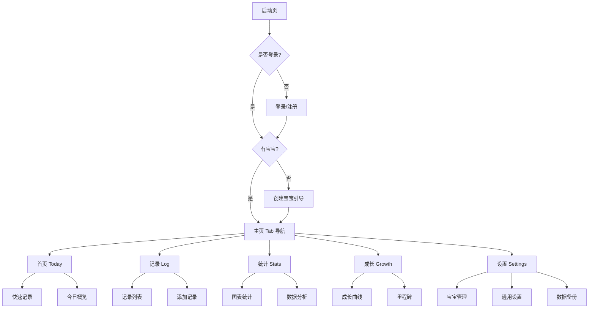

### 5.2 页面布局设计

#### 5.2.1 首页布局

```
┌─────────────────────────────────────┐
│ ☰  [宝宝昵称 ▼]            [+]     │ ← 顶部导航栏
├─────────────────────────────────────┤
│                                     │
│  📅 今天 11月16日 星期六            │
│                                     │
│ ┌─────────────────────────────────┐ │
│ │ 🍼 喂养情况                      │ │
│ │ 今日 6 次 | 总量 420ml           │ │
│ │ ───────────────────────────     │ │
│ │ • 07:30  母乳左侧 15min          │ │
│ │ • 10:00  奶粉 60ml              │ │
│ └─────────────────────────────────┘ │
│                                     │
│ ┌─────────────────────────────────┐ │
│ │ 💤 睡眠情况                      │ │
│ │ 今日 4 次 | 总计 12小时30分      │ │
│ │ ───────────────────────────     │ │
│ │ □ 正在睡眠中... 已 1小时15分     │ │
│ └─────────────────────────────────┘ │
│                                     │
│ ┌─────────────────────────────────┐ │
│ │ 🧷 尿布情况                      │ │
│ │ 大便 2 次 | 小便 5 次            │ │
│ └─────────────────────────────────┘ │
│                                     │
├─────────────────────────────────────┤
│ 🏠  📝  📊  📈  ⚙️                 │ ← 底部导航
└─────────────────────────────────────┘
```

#### 5.2.2 记录列表页布局

```
┌─────────────────────────────────────┐
│ ☰  [宝宝昵称 ▼]            [+]     │
├─────────────────────────────────────┤
│  [全部▼] [今天] [本周] [本月]      │ ← 筛选器
├─────────────────────────────────────┤
│                                     │
│  今天 11月16日                      │
│  ┌───────────────────────────────┐  │
│  │ 🍼 10:30  喂养 - 奶粉 60ml    │  │
│  └───────────────────────────────┘  │
│  ┌───────────────────────────────┐  │
│  │ 🧷 09:45  尿布 - 大便+小便    │  │
│  └───────────────────────────────┘  │
│  ┌───────────────────────────────┐  │
│  │ 💤 07:30  睡眠 - 2小时15分    │  │
│  └───────────────────────────────┘  │
│                                     │
│  昨天 11月15日                      │
│  ┌───────────────────────────────┐  │
│  │ 🍼 22:00  喂养 - 母乳 20min   │  │
│  └───────────────────────────────┘  │
│                                     │
├─────────────────────────────────────┤
│ 🏠  📝  📊  📈  ⚙️                 │
└─────────────────────────────────────┘
```

### 5.3 交互流程关键节点

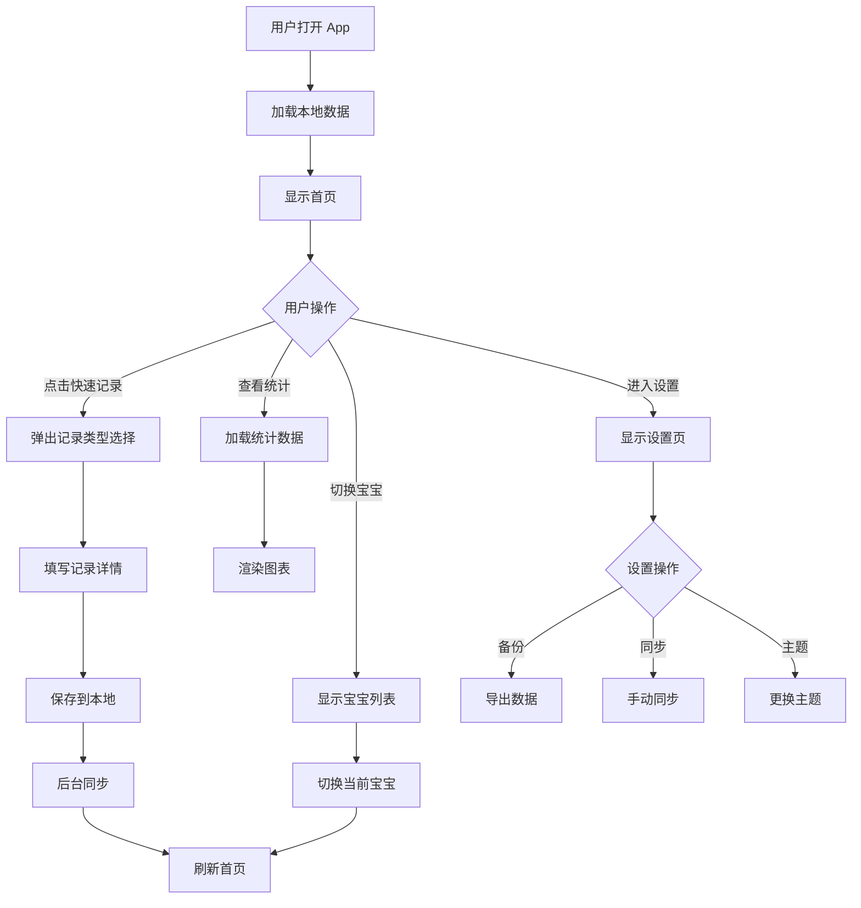

---

## 6. 安全与隐私设计

### 6.1 数据加密策略

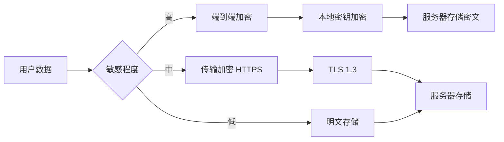

### 6.2 认证与授权流程

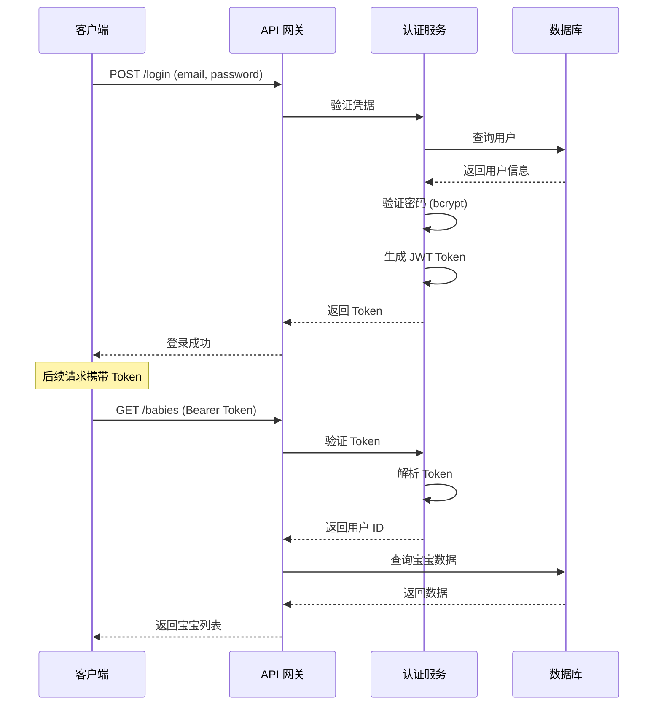

### 6.3 数据权限控制

```typescript
// 权限检查中间件
interface Permission {
  userId: string;
  resource: 'baby' | 'feeding' | 'diaper' | 'sleep' | 'growth';
  action: 'read' | 'write' | 'delete';
  resourceId: string;
}

const checkPermission = async (permission: Permission): Promise<boolean> => {
  // 1. 验证资源是否属于该用户
  const resource = await db.query(
    `SELECT user_id FROM babies WHERE id = ?`,
    [permission.resourceId]
  );
  
  if (!resource || resource.userId !== permission.userId) {
    return false;
  }
  
  // 2. 检查操作权限
  return true;
};
```

---

## 7. 测试方案

### 7.1 测试策略金字塔

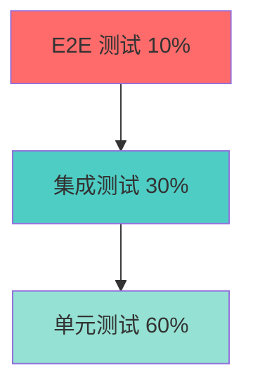

### 7.2 单元测试

#### 7.2.1 工具选择
- **测试框架**: Jest
- **UI 组件测试**: React Native Testing Library
- **Mock 库**: jest-mock

#### 7.2.2 测试覆盖目标

```typescript
// 示例：喂养记录服务测试
describe('FeedingService', () => {
  describe('createFeeding', () => {
    it('应该成功创建母乳喂养记录', async () => {
      const feeding = {
        babyId: 'baby-1',
        type: 'breast' as const,
        leftDuration: 15,
        rightDuration: 10,
        time: Date.now(),
      };
      
      const result = await feedingService.create(feeding);
      
      expect(result.id).toBeDefined();
      expect(result.type).toBe('breast');
      expect(result.leftDuration).toBe(15);
    });
    
    it('应该验证必填字段', async () => {
      const invalidFeeding = {
        type: 'breast' as const,
      };
      
      await expect(
        feedingService.create(invalidFeeding as any)
      ).rejects.toThrow('babyId is required');
    });
    
    it('应该自动计算总时长', async () => {
      const feeding = {
        babyId: 'baby-1',
        type: 'breast' as const,
        leftDuration: 15,
        rightDuration: 10,
        time: Date.now(),
      };
      
      const result = await feedingService.create(feeding);
      
      expect(result.totalDuration).toBe(25);
    });
  });
});
```

#### 7.2.3 测试覆盖率要求

```
整体覆盖率目标：
- 语句覆盖率 (Statement): ≥ 80%
- 分支覆盖率 (Branch): ≥ 75%
- 函数覆盖率 (Function): ≥ 85%
- 行覆盖率 (Line): ≥ 80%

核心模块（数据同步、认证）：≥ 90%
```

### 7.3 集成测试

#### 7.3.1 数据库集成测试

```typescript
describe('Database Integration', () => {
  beforeAll(async () => {
    await setupTestDatabase();
  });
  
  afterAll(async () => {
    await teardownTestDatabase();
  });
  
  beforeEach(async () => {
    await clearAllTables();
  });
  
  it('应该正确处理宝宝和喂养记录的级联删除', async () => {
    // 创建宝宝
    const baby = await db.babies.create({
      name: '测试宝宝',
      birthday: Date.now(),
      gender: 'male',
    });
    
    // 创建喂养记录
    await db.feedings.create({
      babyId: baby.id,
      type: 'breast',
      time: Date.now(),
    });
    
    // 删除宝宝
    await db.babies.delete(baby.id);
    
    // 验证喂养记录也被删除
    const feedings = await db.feedings.findByBabyId(baby.id);
    expect(feedings).toHaveLength(0);
  });
});
```

#### 7.3.2 API 集成测试

```typescript
describe('API Integration', () => {
  let authToken: string;
  
  beforeAll(async () => {
    // 注册测试用户
    const response = await api.post('/auth/register', {
      email: 'test@example.com',
      password: 'Test123456',
    });
    authToken = response.data.token;
  });
  
  it('应该完成完整的喂养记录流程', async () => {
    // 1. 创建宝宝
    const babyResponse = await api.post(
      '/babies',
      { name: '测试宝宝', birthday: Date.now() },
      { headers: { Authorization: `Bearer ${authToken}` } }
    );
    const babyId = babyResponse.data.id;
    
    // 2. 添加喂养记录
    const feedingResponse = await api.post(
      '/feedings',
      { babyId, type: 'breast', leftDuration: 15 },
      { headers: { Authorization: `Bearer ${authToken}` } }
    );
    expect(feedingResponse.status).toBe(201);
    
    // 3. 获取今日统计
    const statsResponse = await api.get(
      `/stats/today?babyId=${babyId}`,
      { headers: { Authorization: `Bearer ${authToken}` } }
    );
    expect(statsResponse.data.feeding.count).toBe(1);
  });
});
```

### 7.4 端到端测试 (E2E)

#### 7.4.1 工具选择
- **框架**: Detox (React Native)
- **模拟器**: iOS Simulator / Android Emulator

#### 7.4.2 关键用户流程测试

```typescript
describe('E2E: 新用户注册到记录喂养', () => {
  beforeAll(async () => {
    await device.launchApp({ newInstance: true });
  });
  
  it('应该完成从注册到记录的完整流程', async () => {
    // 1. 注册
    await element(by.id('register-tab')).tap();
    await element(by.id('email-input')).typeText('newuser@test.com');
    await element(by.id('password-input')).typeText('Password123');
    await element(by.id('register-button')).tap();
    
    // 2. 创建宝宝
    await waitFor(element(by.id('create-baby-screen')))
      .toBeVisible()
      .withTimeout(3000);
    await element(by.id('baby-name-input')).typeText('小宝');
    await element(by.id('baby-birthday-picker')).tap();
    // ... 选择日期
    await element(by.id('save-baby-button')).tap();
    
    // 3. 记录喂养
    await waitFor(element(by.id('today-screen')))
      .toBeVisible()
      .withTimeout(3000);
    await element(by.id('quick-add-button')).tap();
    await element(by.id('feeding-option')).tap();
    await element(by.id('breast-type')).tap();
    await element(by.id('left-duration-input')).typeText('15');
    await element(by.id('save-feeding-button')).tap();
    
    // 4. 验证记录显示
    await expect(element(by.text('母乳'))).toBeVisible();
    await expect(element(by.text('15min'))).toBeVisible();
  });
});
```

### 7.5 性能测试

#### 7.5.1 加载性能测试

```typescript
describe('Performance Tests', () => {
  it('首页加载时间应小于 1 秒', async () => {
    const startTime = performance.now();
    
    await loadHomePage();
    
    const endTime = performance.now();
    const loadTime = endTime - startTime;
    
    expect(loadTime).toBeLessThan(1000);
  });
  
  it('大数据量图表渲染应小于 2 秒', async () => {
    // 插入 1000 条喂养记录
    await seedFeedingRecords(1000);
    
    const startTime = performance.now();
    
    await renderFeedingChart({ range: '30days' });
    
    const endTime = performance.now();
    const renderTime = endTime - startTime;
    
    expect(renderTime).toBeLessThan(2000);
  });
});
```

### 7.6 测试执行计划

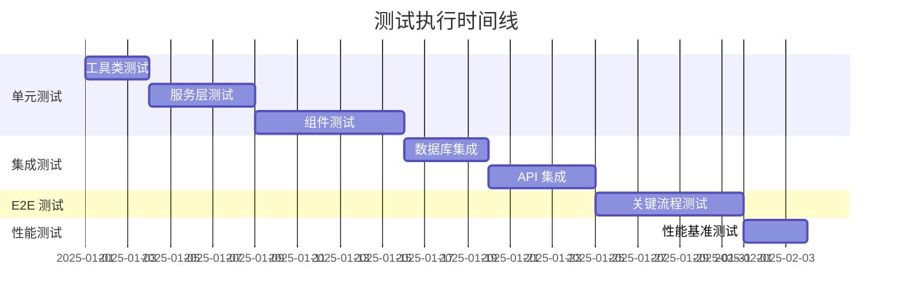

---

## 8. 部署方案

### 8.1 部署架构

```mermaid
graph TB
    subgraph "客户端部署"
        A[iOS App Store]
        B[Android Google Play]
        C[Android 国内应用市场]
    end
    
    subgraph "CDN"
        D[静态资源 CDN]
        E[更新包 CDN]
    end
    
    subgraph "云端服务"
        F[负载均衡器]
        G[API 服务器 1]
        H[API 服务器 2]
        I[数据库主库]
        J[数据库从库]
        K[Redis 缓存]
    end
    
    subgraph "监控与日志"
        L[应用监控]
        M[错误追踪]
        N[日志收集]
    end
    
    A --> D
    B --> D
    C --> D
    D --> F
    E --> F
    F --> G
    F --> H
    G --> I
    H --> I
    I --> J
    G --> K
    H --> K
    
    G --> L
    H --> L
    G --> M
    H --> M
    G --> N
    H --> N
```

### 8.2 客户端部署流程

#### 8.2.1 iOS 部署流程

```mermaid
flowchart TD
    A[开发完成] --> B[运行单元测试]
    B --> C{测试通过?}
    C -->|否| A
    C -->|是| D[构建 Release 版本]
    D --> E[EAS Build for iOS]
    E --> F[生成 IPA 文件]
    F --> G[上传到 App Store Connect]
    G --> H[填写应用信息]
    H --> I[提交审核]
    I --> J{审核通过?}
    J -->|否| K[修改问题]
    K --> A
    J -->|是| L[发布到 App Store]
    L --> M[推送更新通知]
```

#### 8.2.2 Android 部署流程

```mermaid
flowchart TD
    A[开发完成] --> B[运行单元测试]
    B --> C{测试通过?}
    C -->|否| A
    C -->|是| D[构建 Release 版本]
    D --> E[EAS Build for Android]
    E --> F[生成 APK/AAB]
    F --> G[签名应用]
    G --> H{发布渠道?}
    H -->|Google Play| I[上传到 Play Console]
    H -->|国内市场| J[上传到各应用商店]
    I --> K[填写应用信息]
    J --> K
    K --> L[提交审核]
    L --> M[发布上线]
```

### 8.3 服务端部署

#### 8.3.1 容器化部署

```yaml
# docker-compose.yml
version: '3.8'

services:
  api:
    image: babybeats-api:latest
    ports:
      - "3000:3000"
    environment:
      - NODE_ENV=production
      - DATABASE_URL=${DATABASE_URL}
      - REDIS_URL=${REDIS_URL}
      - JWT_SECRET=${JWT_SECRET}
    depends_on:
      - postgres
      - redis
    deploy:
      replicas: 2
      restart_policy:
        condition: on-failure
  
  postgres:
    image: postgres:15
    volumes:
      - postgres_data:/var/lib/postgresql/data
    environment:
      - POSTGRES_DB=babybeats
      - POSTGRES_USER=${DB_USER}
      - POSTGRES_PASSWORD=${DB_PASSWORD}
  
  redis:
    image: redis:7-alpine
    volumes:
      - redis_data:/data
  
  nginx:
    image: nginx:alpine
    ports:
      - "80:80"
      - "443:443"
    volumes:
      - ./nginx.conf:/etc/nginx/nginx.conf
      - ./ssl:/etc/nginx/ssl
    depends_on:
      - api

volumes:
  postgres_data:
  redis_data:
```

#### 8.3.2 CI/CD 流程

```mermaid
flowchart LR
    A[Git Push] --> B[触发 CI]
    B --> C[代码检查]
    C --> D[运行测试]
    D --> E{测试通过?}
    E -->|否| F[通知失败]
    E -->|是| G[构建 Docker 镜像]
    G --> H[推送到镜像仓库]
    H --> I{部署环境?}
    I -->|Staging| J[部署到测试环境]
    I -->|Production| K[部署到生产环境]
    J --> L[运行 E2E 测试]
    L --> M{测试通过?}
    M -->|是| N[通知成功]
    M -->|否| F
    K --> O[灰度发布]
    O --> P[监控指标]
    P --> Q{指标正常?}
    Q -->|是| R[全量发布]
    Q -->|否| S[回滚]
```

### 8.4 环境配置

#### 8.4.1 环境划分

```
开发环境 (Development)
├── 本地开发数据库
├── Mock API 服务
└── 调试模式

测试环境 (Staging)
├── 测试数据库
├── 完整后端服务
└── 接近生产配置

生产环境 (Production)
├── 生产数据库（主从）
├── 负载均衡
├── CDN 加速
└── 完整监控
```

#### 8.4.2 配置管理

```typescript
// config/index.ts
export const config = {
  development: {
    apiUrl: 'http://localhost:3000',
    databasePath: 'dev.db',
    enableDebug: true,
    logLevel: 'debug',
  },
  staging: {
    apiUrl: 'https://staging-api.babybeats.com',
    databasePath: 'staging.db',
    enableDebug: true,
    logLevel: 'info',
  },
  production: {
    apiUrl: 'https://api.babybeats.com',
    databasePath: 'production.db',
    enableDebug: false,
    logLevel: 'error',
  },
};

export const getConfig = () => {
  const env = process.env.APP_ENV || 'development';
  return config[env];
};
```

### 8.5 监控与告警

#### 8.5.1 监控指标

```mermaid
graph TD
    A[监控系统] --> B[应用性能监控 APM]
    A --> C[错误追踪]
    A --> D[用户行为分析]
    A --> E[服务器监控]
    
    B --> B1[API 响应时间]
    B --> B2[数据库查询性能]
    B --> B3[内存使用率]
    
    C --> C1[崩溃率]
    C --> C2[错误堆栈]
    C --> C3[异常分布]
    
    D --> D1[活跃用户数]
    D --> D2[功能使用率]
    D --> D3[用户留存率]
    
    E --> E1[CPU 使用率]
    E --> E2[内存使用率]
    E --> E3[磁盘空间]
```

#### 8.5.2 告警规则

```yaml
# 告警配置
alerts:
  - name: high_error_rate
    condition: error_rate > 5%
    duration: 5m
    severity: critical
    channels: [email, slack]
    
  - name: slow_api_response
    condition: api_response_time > 2s
    duration: 10m
    severity: warning
    channels: [slack]
    
  - name: high_cpu_usage
    condition: cpu_usage > 80%
    duration: 15m
    severity: warning
    channels: [email]
    
  - name: database_connection_pool_exhausted
    condition: db_connections > 90%
    duration: 5m
    severity: critical
    channels: [email, slack, sms]
```

### 8.6 备份与恢复策略

#### 8.6.1 数据备份

```mermaid
flowchart TD
    A[定时任务] --> B[触发备份]
    B --> C[全量备份数据库]
    C --> D[压缩备份文件]
    D --> E[加密备份文件]
    E --> F{备份目标}
    F -->|主存储| G[对象存储 S3]
    F -->|异地| H[异地备份中心]
    F -->|归档| I[冷存储归档]
    G --> J[保留 30 天]
    H --> K[保留 90 天]
    I --> L[保留 1 年]
    J --> M[自动清理]
    K --> M
    L --> M
```

#### 8.6.2 备份策略

```
每日备份：
  - 时间：凌晨 2:00
  - 类型：增量备份
  - 保留：7 天

每周备份：
  - 时间：周日凌晨 3:00
  - 类型：全量备份
  - 保留：4 周

每月备份：
  - 时间：每月 1 号凌晨 4:00
  - 类型：全量备份
  - 保留：12 个月
```

#### 8.6.3 灾难恢复流程

```mermaid
sequenceDiagram
    participant A as 监控系统
    participant B as 运维团队
    participant C as 备份系统
    participant D as 生产环境
    
    A->>B: 检测到严重故障
    B->>B: 评估影响范围
    B->>D: 尝试快速修复
    
    alt 修复成功
        D-->>B: 服务恢复
        B->>A: 确认恢复
    else 修复失败
        B->>C: 请求最近备份
        C-->>B: 提供备份文件
        B->>D: 停止故障服务
        B->>D: 从备份恢复
        D->>D: 验证数据完整性
        D-->>B: 恢复完成
        B->>A: 服务重新上线
    end
    
    B->>B: 记录事故报告
```

### 8.7 发布策略

#### 8.7.1 灰度发布

```mermaid
flowchart LR
    A[新版本] --> B[5% 用户]
    B --> C{监控指标}
    C -->|正常| D[20% 用户]
    C -->|异常| E[回滚]
    D --> F{监控指标}
    F -->|正常| G[50% 用户]
    F -->|异常| E
    G --> H{监控指标}
    H -->|正常| I[100% 用户]
    H -->|异常| E
```

#### 8.7.2 版本管理

```
版本号规则：主版本.次版本.修订号 (Major.Minor.Patch)

主版本 (Major)：
  - 重大功能更新
  - 不兼容的 API 变更
  - 架构重构

次版本 (Minor)：
  - 新增功能
  - 向后兼容的变更

修订号 (Patch)：
  - Bug 修复
  - 性能优化
  - 安全补丁

示例：
  - 1.0.0：首个正式版本
  - 1.1.0：新增疫苗提醒功能
  - 1.1.1：修复睡眠计时器 bug
  - 2.0.0：全新 UI 设计
```

---

## 9. 运维与支持

### 9.1 日志管理

```typescript
// 日志级别和格式
enum LogLevel {
  DEBUG = 'debug',
  INFO = 'info',
  WARN = 'warn',
  ERROR = 'error',
  FATAL = 'fatal',
}

interface LogEntry {
  timestamp: number;
  level: LogLevel;
  message: string;
  context?: Record<string, any>;
  userId?: string;
  babyId?: string;
  stackTrace?: string;
}

// 日志收集策略
class Logger {
  log(entry: LogEntry) {
    // 1. 本地写入（用于离线场景）
    this.writeToLocal(entry);
    
    // 2. 批量上传到服务器
    this.queueForUpload(entry);
    
    // 3. 严重错误立即上传
    if (entry.level === LogLevel.ERROR || entry.level === LogLevel.FATAL) {
      this.uploadImmediately(entry);
    }
  }
}
```

### 9.2 性能优化

#### 9.2.1 客户端优化

```typescript
// 1. 列表虚拟化
import { FlashList } from '@shopify/flash-list';

<FlashList
  data={records}
  renderItem={({ item }) => <RecordItem record={item} />}
  estimatedItemSize={80}
/>

// 2. 图片懒加载
<Image
  source={{ uri: imageUrl }}
  placeholder={placeholderImage}
  cachePolicy="memory-disk"
/>

// 3. 数据库查询优化
// 使用索引
db.execute(`
  CREATE INDEX IF NOT EXISTS idx_feedings_baby_time 
  ON feedings(baby_id, time DESC)
`);

// 4. 状态管理优化
// 使用 Zustand 的选择器避免不必要的重渲染
const babyName = useBabyStore(state => state.currentBaby?.name);
```

#### 9.2.2 服务端优化

```typescript
// 1. API 响应缓存
app.get('/api/stats/:babyId/today', cache('5 minutes'), async (req, res) => {
  const stats = await calculateTodayStats(req.params.babyId);
  res.json(stats);
});

// 2. 数据库连接池
const pool = new Pool({
  max: 20,
  min: 5,
  idle: 10000,
});

// 3. 批量查询优化
const babies = await Baby.findAll({
  where: { userId },
  include: [{
    model: Feeding,
    where: {
      time: { [Op.gte]: startOfToday },
    },
    required: false,
  }],
});

// 4. 异步任务队列
import Bull from 'bull';

const syncQueue = new Bull('data-sync', {
  redis: redisConfig,
});

syncQueue.process(async (job) => {
  await syncDataToServer(job.data);
});
```

### 9.3 故障排查手册

```mermaid
flowchart TD
    A[用户报告问题] --> B{问题类型}
    
    B -->|崩溃| C[查看崩溃日志]
    B -->|功能异常| D[查看错误日志]
    B -->|性能问题| E[查看性能指标]
    B -->|数据问题| F[查看数据同步日志]
    
    C --> G[定位代码行]
    D --> G
    E --> H[分析慢查询]
    F --> I[检查同步状态]
    
    G --> J[修复代码]
    H --> K[优化性能]
    I --> L[重新同步]
    
    J --> M[测试验证]
    K --> M
    L --> M
    
    M --> N[发布补丁版本]
```

---

## 10. 项目里程碑与时间规划

### 10.1 开发阶段划分

```mermaid
gantt
    title BabyBeats 项目开发计划
    dateFormat YYYY-MM-DD
    
    section 阶段一：基础架构
    项目初始化              :2025-01-01, 3d
    数据库设计              :2025-01-04, 5d
    API 设计                :2025-01-09, 5d
    认证模块                :2025-01-14, 7d
    
    section 阶段二：核心功能
    多宝宝管理              :2025-01-21, 7d
    喂养记录                :2025-01-28, 7d
    睡眠记录                :2025-02-04, 5d
    尿布记录                :2025-02-09, 5d
    挤奶记录                :2025-02-14, 5d
    
    section 阶段三：扩展功能
    成长记录                :2025-02-19, 7d
    医疗记录                :2025-02-26, 7d
    数据统计                :2025-03-05, 10d
    
    section 阶段四：优化完善
    UI/UX 优化              :2025-03-15, 7d
    性能优化                :2025-03-22, 5d
    适老化改造              :2025-03-27, 5d
    数据导入导出            :2025-04-01, 5d
    
    section 阶段五：测试发布
    集成测试                :2025-04-06, 7d
    E2E 测试                :2025-04-13, 7d
    Beta 测试               :2025-04-20, 14d
    正式发布                :2025-05-04, 7d
```

### 10.2 版本规划

```
V1.0（MVP）- 2025年5月
├── 用户认证与同步
├── 多宝宝管理
├── 日常记录（喂养、睡眠、尿布、挤奶）
├── 基础统计图表
└── 数据导出

V1.1 - 2025年7月
├── 成长记录与曲线
├── 里程碑记录
├── 改进的数据统计
└── 性能优化

V1.2 - 2025年9月
├── 医疗记录（看病、用药、疫苗）
├── 提醒功能
├── 数据导入
└── 主题定制

V2.0 - 2025年12月
├── 图片上传
├── 社区分享（可选）
├── AI 智能分析
└── 多语言支持
```

---

## 11. 风险管理

### 11.1 技术风险

| 风险 | 影响 | 概率 | 应对策略 |
|------|------|------|----------|
| React Native 兼容性问题 | 高 | 中 | 充分测试，准备降级方案 |
| 数据同步冲突 | 高 | 中 | 设计完善的冲突解决机制 |
| 性能问题（大数据量） | 中 | 高 | 数据分页、虚拟化列表 |
| 第三方依赖不稳定 | 中 | 低 | 选择稳定的库，做好版本锁定 |

### 11.2 业务风险

| 风险 | 影响 | 概率 | 应对策略 |
|------|------|------|----------|
| 用户隐私泄露 | 高 | 低 | 加密传输、权限控制、安全审计 |
| 数据丢失 | 高 | 低 | 多重备份、iCloud 同步 |
| 应用商店审核不通过 | 中 | 中 | 提前了解审核规则，准备申诉材料 |
| 用户留存率低 | 中 | 中 | 持续优化体验，建立用户反馈机制 |

---

## 12. 总结

本设计文档详细描述了宝宝成长记录 App（Baby Beats）的完整技术设计方案，涵盖：

1. **架构设计**：采用 Expo + React Native 跨平台架构，本地 SQLite + 云端同步
2. **模块设计**：认证同步、多宝宝管理、日常记录、数据统计、导入导出等核心模块
3. **数据设计**：完整的数据库 ER 图和表结构设计
4. **测试方案**：单元测试、集成测试、E2E 测试的完整策略
5. **部署方案**：CI/CD 流程、容器化部署、监控告警体系
6. **运维支持**：日志管理、性能优化、故障排查

### 12.1 核心优势

- ✅ **技术成熟**：基于成熟的 React Native 生态
- ✅ **架构清晰**：分层架构，职责明确
- ✅ **扩展性强**：模块化设计，易于扩展
- ✅ **用户友好**：适老化设计，操作简单
- ✅ **数据安全**：多重备份，隐私保护

### 12.2 后续优化方向

1. **智能化**：引入 AI 分析宝宝作息规律
2. **社区化**：育儿经验分享社区
3. **国际化**：支持更多语言和地区
4. **硬件集成**：对接智能体重秤、体温计等设备

---

**文档版本**: V1.0  
**最后更新**: 2025-11-16  
**维护团队**: BabyBeats 开发团队

